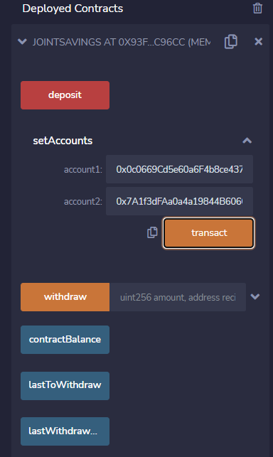
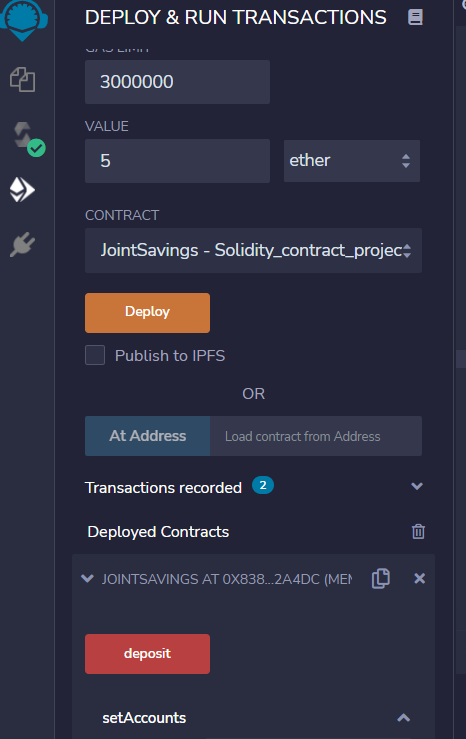

# Smart Contracts - Solidity - Joint Savings Account
## By Franklin Vaca

The program/code can be found in the joint_savings.sol file which was written using Remix IDE. 
The images that were included in this analysis that display the execution of the contract can be found in the Execution_Results folder.

## **Application screenshot:**

*Overall screenshot* 

 

The contract was created and compiled. It compiled without any issues as indicated by the check mark next to the compiling icon (on the left). The contract was deployed and no errors were found.

## **Interactions with the Deployed Smart Contract**

### **Setting Accounts**
*Accounts one and two were set:* 

 

### **Contract's Deposit Functionality**
### **Transaction 1: Send 1 ether as wei.**

The initial contract balance was zero.

*Initial Contract balance:*

 

 1 eth was deposited in the contract:

 

 new contract Balance (including 1 eth expressed in wei 1x10e18):

 

### **Transaction 2: Send 10 ether as wei.**

 10 eth deposited in the contract:

 

 new contract Balance (including (10+1) = 11 eth expressed in wei 11x10e18):

 

### **Transaction 3: Send 5 ether as wei.**

 5 eth deposited in the contract:

 

 new contract Balance:  (11+1  = 16 eth expressed in wei 16x10e18):

 

### **Contract's Withdrawal Functionality**
### **Transaction 4: Withdraw 5 ether into accountOne.**

 5 eth sent into accountOne, as indicated by the new contract balance, lastToWithdraw and lastWithdrawAmount of the contract:

 

 The new contract balance decreased from 16 eth (16x10e18 wei) to 11 eth. accountOne received those 5 eth as indicated by the last to Withdraw address and amount.

### **Transaction 5: Withdraw 10 ether into accountTwo.**

 10 eth sent into accountTwo as indicated by the new contract balance, lastToWithdraw and lastWithdrawAmount of the contract:

 

 The new contract balance decreased from 11 eth to 1 eth. accountTwo received those 10 eth as indicated by the last to Withdraw address and amount.

 The full screen images of each transaction were also included in the Execution_Results folder to show that no bugs/errors occurred while testing the functions of the contract.
